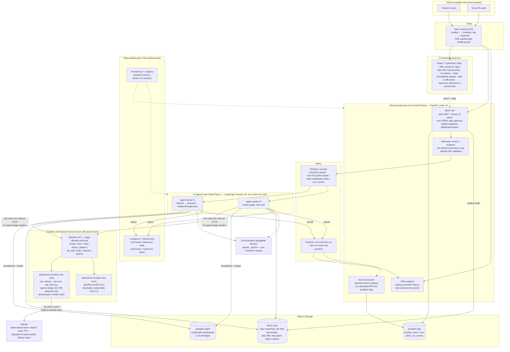
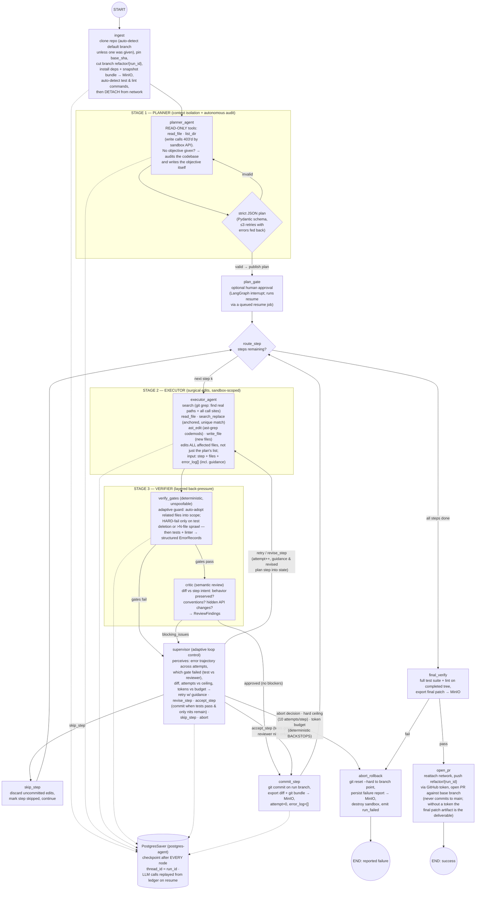

# Refactor Harness

Multi-tenant web application that runs autonomous AI refactoring agents (Planner → Executor → Verifier ⇄ Supervisor) against GitHub repositories. Three microservices — React/TS frontend, FastAPI backend control plane, LangGraph agent workers — plus a privileged sandbox orchestrator, two Postgres instances, Redis, MinIO, and a Langfuse/Prometheus/Grafana observability stack. Docker Compose only; no Kubernetes.

## Prerequisites

- Docker
- An OpenAI or Gemini API key
- Optionally a GitHub token — without it (or if it lacks push rights), runs still finish with a downloadable patch instead of a pull request

### GitHub token requirements (for automatic PRs)

The token must be able to **push** to the target repository:

- **Classic personal access token**: the `repo` scope.
- Organization repos may additionally require the token to be SSO-authorized for that org.

The harness verifies this at ingest and warns in the run's activity feed if the token can't push; a push failure never discards a finished refactor — the run completes with the final patch artifact.

## Quick start

```bash
cp .env.example .env        # then set OPENAI_API_KEY (or GOOGLE_API_KEY) and optionally GITHUB_TOKEN

make up                     # or: docker compose up -d --build

open http://localhost:8080
```

One command brings up everything: the three microservices, the sandbox orchestrator, the per-run sandbox image build, both Postgres instances, Redis, MinIO, and the observability stack (Langfuse, Prometheus, Grafana). Run `make help` for all targets.

Create an organization, paste a repository URL, and watch the run live: the agent audits the codebase, plans the work, refactors it step by step with a self-correcting verification loop, and opens a pull request — all streamed over SSE.

## Scaling workers

One worker handles exactly one concurrent run:

```bash
make scale WORKERS=8        # or: docker compose up -d --scale agent-worker=8
```

## Observability

Started automatically with `make up`:

- Langfuse: http://localhost:3001 — create a project, put its keys in `.env` (`LANGFUSE_PUBLIC_KEY` / `LANGFUSE_SECRET_KEY`), then re-run `make up` to enable LLM tracing. Leave `LANGFUSE_HOST=http://langfuse-web:3000` (the internal container port — not the `3001` you browse to).
- Prometheus: http://localhost:9092 · Grafana: http://localhost:3002 (admin/admin)

## Run history

The dashboard keeps the repo-URL launcher pinned at the top while the history scrolls beneath it. History supports full-text search (repository or objective), status filtering (all / in progress / completed / failed), infinite-scroll lazy loading, and per-run deletion (completed and failed runs; in-progress runs must finish first). Deleting a run also removes its stored artifacts.

## Service map

| URL | Service |
|---|---|
| http://localhost:8080 | web app (nginx → frontend + `/api` → backend) |
| http://localhost:9001 | MinIO console |
| http://localhost:3001 | Langfuse |
| http://localhost:9092 / :3002 | Prometheus / Grafana |

## Architecture

### High level

Three microservices behind nginx. The backend is a stateless control plane; the agent layer scales horizontally (one active run per worker); only the sandbox orchestrator is privileged. State lives in Postgres/Redis/MinIO, so scaling is just adding workers.



### Low level — LangGraph orchestration

One graph instance per run, executed inside a single agent-worker, checkpointed to `postgres-agent` after every node. The Planner audits and plans, the Executor makes surgical cross-cutting edits, the Verifier gates them (tests + critic), and the Supervisor adaptively drives the loop (retry / revise / accept / skip / abort).



### Highlights

- **Isolation**: only the sandbox orchestrator mounts the Docker socket. Each run gets an ephemeral container + volume (non-root, cap-dropped, egress network attached only during clone/install/push). The Planner stage is rejected server-side on any write endpoint.
- **Resilience**: LangGraph checkpoints in `postgres-agent`, jobs on Redis Streams with `XAUTOCLAIM` reclaim and claim heartbeats, sandbox reconstruction from MinIO git bundles, and an LLM call ledger so a resumed run replays completions instead of re-billing them.
- **Guardrails**: an adaptive supervisor drives the verification loop (retry with guidance, revise step scope, accept when tests pass and only reviewer nits remain, skip step, or abort based on the error trajectory), bounded by deterministic backstops — a 10-attempt-per-step hard ceiling and a per-run token budget. Because refactoring is cross-cutting, the Executor can `search` (git grep) for real paths and all call sites, and the scope guard auto-adopts the related files it edits rather than blocking them; only test deletion and runaway file-count sprawl hard-fail, with tests and the LLM critic enforcing that a change is complete and correct.
